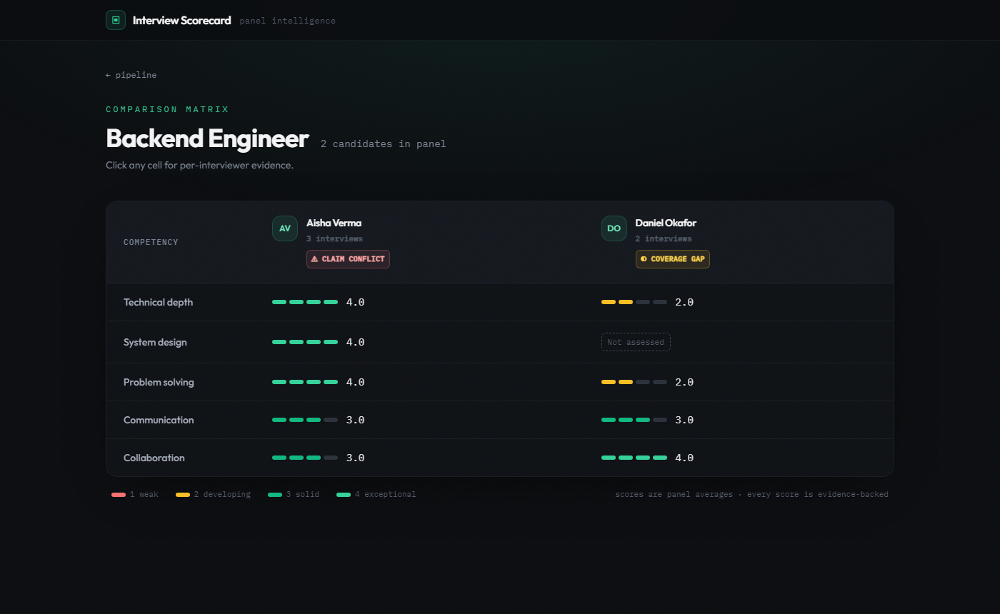
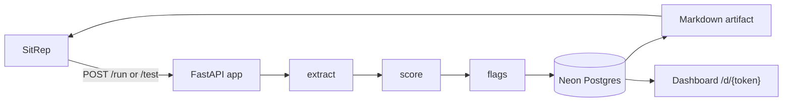

# Interview Scorecard

A SitRep agent that turns an interview debrief meeting into a structured, evidence-backed scorecard.

- Extracts candidate, role, and interviewer claims from the meeting summary, then scores each competency against a role-specific rubric — scores without supporting evidence are automatically demoted rather than reported at face value.
- Detects cross-interviewer disagreement, rubric coverage gaps, and compliance flags (e.g. comp/eligibility topics), and surfaces them alongside the scores.
- Persists every interview to Postgres and builds a live comparison matrix and per-candidate dashboard, in addition to returning a markdown artifact on every call.



## Architecture



`extract`, `score`, and `flags` are three independent structured LLM calls. Extraction and flag detection run off the raw meeting summary; scoring runs against the rubric resolved for the role. Results are persisted before the artifact is composed, so the dashboard always reflects what was returned to SitRep.

## Local setup

```bash
python -m venv .venv
.venv\Scripts\activate
pip install -r requirements.txt
copy .env.example .env   # fill in GEMINI_API_KEY / GROQ_API_KEY; DATABASE_URL defaults to sqlite:///local.db
uvicorn app.main:app --reload
```

Seed the local database with the bundled fixtures once the server is running:

```bash
.venv\Scripts\python scripts/seed.py http://localhost:8000
```

Then open `http://localhost:8000/d/<DASHBOARD_TOKEN>` (the token is whatever you set in `.env`, `dev-token` by default).

## Deployment

The repo ships a Render Blueprint (`render.yaml`) for a single free-tier web service.

1. Push the repo to GitHub (public).
2. On [render.com](https://render.com): **New → Blueprint**, select the repo.
3. Set the five secret env vars on the service:
   - `GEMINI_API_KEY` — from aistudio.google.com
   - `GROQ_API_KEY` — from console.groq.com
   - `DATABASE_URL` — a Neon Postgres connection string from the [neon.tech](https://neon.tech) dashboard (`postgresql+psycopg2://...`)
   - `DASHBOARD_TOKEN` — generate with `python -c "import secrets; print(secrets.token_urlsafe(32))"`
   - `BASE_URL` — the Render URL, once assigned (`https://<app>.onrender.com`)
4. Confirm `https://<app>.onrender.com/healthz` returns `{"ok": true}`.
5. Add an [UptimeRobot](https://uptimerobot.com) HTTP monitor on `/healthz` at a 10-minute interval to keep the free-tier instance warm.

## SitRep configuration

In SitRep Studio, configure the agent as a **Remote** build:

- **Endpoint URL**: `https://<app>.onrender.com` (SitRep appends `/run` and `/test`)
- **Trigger**: Summary (runs when a meeting summary is finalized)
- **Instructions override**: to pin a rubric instead of using the role-family default, add a line to the agent instructions in the form:

  ```
  competencies: System design, Debugging, Communication, Ownership
  ```

  Any comma-separated list after `competencies:` replaces the resolved default rubric for that run.

## Testing

```bash
pytest
```

Unit tests cover the pipeline passes, rubric resolution, and analytics in isolation; integration tests exercise `/run` and `/test` against a SQLite session with the LLM providers monkeypatched, so the suite runs with no network access and no API keys.

## Free-tier notes

- Primary model: `gemini-2.5-flash` (Gemini free tier).
- Fallback model: `llama-3.3-70b-versatile` (Groq free tier).
- Each of the three structured calls retries on the primary provider, then falls back to Groq, before giving up.
- If both providers are unavailable, `/run` and `/test` still return `200` with a markdown artifact explaining the outage — the agent never returns a 5xx to SitRep.
